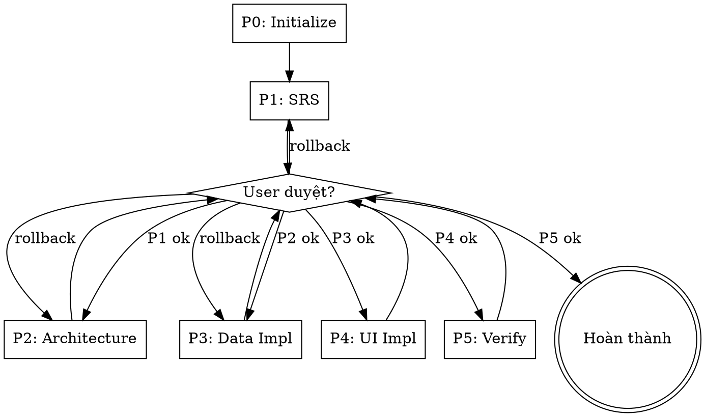

# Feature Workflow Orchestrator

Skill này KHÔNG tự thiết kế hay implement. Skill này chỉ chỉ huy thứ tự load các skill khác, quản lý plan file, và enforce gate giữa các phase.

## Khi nào dùng

- User muốn xây dựng feature/màn hình mới end-to-end.
- User nói "chain workflow", "feature workflow", "build theo plan".
- User cần đi tuần tự SRS -> Architecture -> Code mà không bị nhảy bước.

## Khi nào KHÔNG dùng

- User chỉ muốn tạo SRS đơn lẻ -> dùng `srs-generator` trực tiếp.
- User chỉ muốn thiết kế kiến trúc cho SRS đã có -> dùng `architecture-designer` trực tiếp.
- User chỉ muốn implement UI cho doc đã có -> dùng `ui-android-compose`/`ui-android-xml` trực tiếp.
- User chỉ sửa bug, refactor nhỏ, hoặc làm task không phải feature mới.

<HARD-GATE>
- Mỗi phase chỉ được mark `done` sau khi User reply rõ ràng đồng ý (vd: "duyệt", "approved", "ok tiếp"). Không tự suy diễn.
- KHÔNG bỏ qua phase. KHÔNG đảo thứ tự phase.
- KHÔNG được tự load skill phase sau khi phase trước chưa `done`.
- Mỗi lần kết thúc phase phải UPDATE plan file trước khi sang phase kế tiếp.
- Khi context bị compact, BẮT BUỘC đọc lại plan file để xác định phase đang chạy trước khi tiếp tục.
- KHÔNG chạy bất kỳ phase implementation nào (Phase 3, 4) khi tài liệu Architecture (Phase 2) chưa được User duyệt.
</HARD-GATE>

## Cấu trúc Phase

| # | Phase | Skill được load                                                                                                                                                     | Output |
|---|-------|---------------------------------------------------------------------------------------------------------------------------------------------------------------------|--------|
| 0 | Initialize | `android-code-indexer` (init/refresh `docs/code-index/`)                                                                                                            | `docs/<feature>/00-plan.md` + `docs/code-index/` snapshot |
| 1 | SRS | `srs-generator`                                                                                                                                                     | `docs/<feature>/01-srs.md` |
| 2 | Architecture | `architecture-designer` (đọc `docs/code-index/` để tái dùng)                                                                                                        | `docs/<feature>/02-ui-layer.md`, `docs/<feature>/03-data-layer.md` |
| 3 | Data Layer Impl | `android-code-indexer` (update sau implement); đọc `architecture-designer/rules/repository-rule.md`                                                                 | Source code Repository/DataSource/model + index refresh |
| 4 | UI Layer Impl | `ui-android-compose`/`ui-android-xml` (tùy công nghệ dự án hoặc yêu cầu user) + `android-resource-policy` (khi cần) + `android-code-indexer` (update sau implement) | Source code Composable/ViewModel/UiState + index refresh |
| 5 | Verify & Finalize | `android-code-indexer` (final pass)                                                                                                                                 | Build pass + plan đánh dấu DONE + index đầy đủ |

## Sơ đồ Quy trình



## Phase 0 - Initialize

Mục tiêu: chốt feature name, output paths, tạo plan file, đảm bảo `docs/code-index/` sẵn sàng làm map tham chiếu cho các phase sau.

Bắt buộc:

1. Hỏi User feature name (kebab-case, ví dụ: `iap-screen`, `home-screen`). Một câu hỏi mỗi lần.
2. Hỏi đường dẫn `docs/<feature>/` có dùng default không, nếu user muốn override.
3. Kiểm tra `docs/<feature>/` đã tồn tại chưa:
   - Nếu chưa: tạo thư mục.
   - Nếu đã có file `01-srs.md` / `02-ui-layer.md` / `03-data-layer.md`: hỏi User có resume từ phase phù hợp hay làm lại từ đầu.
4. **Code index init/refresh** (BẮT BUỘC):
   - Load skill `android-code-indexer`.
   - Nếu `docs/code-index/` chưa tồn tại: để skill tạo full index từ đầu (`_meta.md`, `modules/`, `graph/`, `issues.md`).
   - Nếu đã tồn tại: để skill chạy incremental refresh (so sánh index hiện tại với trạng thái source code hiện tại trên đĩa, cập nhật node thay đổi). KHÔNG quét lại toàn bộ project khi không cần.
   - Báo cáo cho User tóm tắt: số module đã index, issue mới (nếu có).
5. Tạo file `docs/<feature>/00-plan.md` từ template `templates/00-plan-template.md` (cùng folder skill này), thay placeholder `<FEATURE_NAME>` bằng tên thật và `<CREATED_AT>` bằng ngày hiện tại.
6. Báo cáo plan file path + index status cho User và xin confirm trước khi sang Phase 1.

Done condition: User reply confirm + plan file đã tồn tại + Phase 0 trong plan đã đánh `[x]` + `docs/code-index/_meta.md` có `last_updated` của hôm nay.

## Phase 1 - SRS

Mục tiêu: tài liệu chức năng thuần.

Bắt buộc:

1. Load skill `srs-generator` qua tool `skill`.
2. Để `srs-generator` chạy đầy đủ workflow nội bộ (hỏi đáp -> trình bày -> viết file -> self review -> user gate).
3. Khi `srs-generator` hoàn tất và User reply duyệt:
   - Update `docs/<feature>/00-plan.md`: Phase 1 chuyển từ `[ ]` -> `[x]`, ghi timestamp completed, link tới `01-srs.md`.
   - Hỏi User: "Phase 1 đã done. Sang Phase 2 - Architecture?".
4. Nếu User yêu cầu sửa SRS: chạy lại vòng review của `srs-generator`, không update plan cho đến khi user duyệt.

Done condition: `01-srs.md` tồn tại + User reply duyệt + plan ghi nhận done + User confirm sang phase tiếp.

## Phase 2 - Architecture

Bắt buộc:

1. Load skill `architecture-designer`.
2. Đọc `01-srs.md` đã chốt từ Phase 1.
3. **Đọc `docs/code-index/`** trước khi đề xuất kiến trúc:
   - `_meta.md` để biết module map.
   - `modules/*.md` để tìm Repository/DataSource/Model có thể tái dùng.
   - `graph/calls.md`, `graph/data_flow.md` để hiểu luồng dữ liệu hiện tại.
   - Nếu thấy node có thể tái dùng, BẮT BUỘC nhắc trong tài liệu kiến trúc và đánh dấu "giữ nguyên" / "mở rộng".
4. Để `architecture-designer` chạy đầy đủ (đọc rule, khảo sát project, hỏi đáp Data Layer, đề xuất Shared Repository Contract, viết 2 file).
5. Khi User reply duyệt cả `02-ui-layer.md` và `03-data-layer.md`:
   - Update plan: Phase 2 done, link 2 file.
   - Hỏi User: "Phase 2 done. Sang Phase 3 - Data Layer Implementation?".

Done condition: cả 2 file architecture đã tồn tại, Shared Repository Contract chốt + đã đối chiếu với `docs/code-index/` + User duyệt + plan update.

## Phase 3 - Data Layer Implementation

Bắt buộc:

1. KHÔNG load `srs-generator` hay `architecture-designer` lại.
2. Đọc `docs/<feature>/03-data-layer.md` và `.opencode/skills/architecture-designer/rules/repository-rule.md`.
3. Tuân thủ rule repo: comment-free Kotlin, YAGNI, không dùng deprecated API, dùng `DataResult` wrapper, đăng ký Hilt `@Binds` trong `di/RepositoryModule.kt`.
4. Implement theo thứ tự: model -> DataSource -> Repository interface (`domain/repository/`) -> Repository impl (`data/repository/`) -> Hilt binding -> tái dùng helper trong `data/utils/ResultExtension.kt`.
5. Chỉ implement những Repository function khai báo trong Shared Repository Contract của Phase 2. Không tự thêm.
6. Sau khi implement, tự kiểm:
   - File nào mới? File nào sửa?
   - Có comment Kotlin nào không? Phải xóa.
   - Có gọi network/database trực tiếp ngoài Repository không?
   - Hilt binding đã thêm chưa?
7. **Update code index** (BẮT BUỘC trước khi xin User duyệt):
   - Load skill `android-code-indexer`.
   - Để skill chạy incremental update: thêm Repository/DataSource/model mới vào `modules/<module>.md`, bổ sung edge vào `graph/calls.md` và `graph/data_flow.md`, refresh `_meta.md`.
   - Nếu phát hiện violation (UI -> Repository, ViewModel -> DataSource), ghi vào `issues.md` và báo User trước khi sang Phase 4.
8. Báo cáo cho User danh sách file đã thay đổi + diff tóm tắt + index update summary + xin duyệt.

Done condition: User reply duyệt + plan update + danh sách file ghi vào plan + `docs/code-index/` đã refresh và không còn issue CRITICAL liên quan tới feature.

## Phase 4 - UI Layer Implementation

Bắt buộc:

1. Load skill `ui-android-compose`/`ui-android-xml` tùy thuộc vào công nghệ dự án hoặc yêu cầu user. Khi cần resource, load thêm `android-resource-policy`.
2. Đọc `docs/<feature>/02-ui-layer.md` và `.opencode/skills/architecture-designer/rules/viewmodel-mvi-rule.md`.
3. Đọc `docs/code-index/modules/app.md` (hoặc module liên quan) để biết Route, Composable hiện có và tránh tạo trùng tên.
4. Tuân thủ rule repo bổ sung trong `AGENTS.md`:
   - Navigation 3 only: `entry<Route.X>`, `rememberNavBackStack`. KHÔNG dùng `NavHost`/`composable("route")`.
   - ViewModel scope qua `hiltViewModel()` bên trong `entry { }`.
   - Compose theme dùng `Theme.ComposeScreen`.
   - Không thêm comment Kotlin. YAGNI.
5. Implement theo thứ tự: Route subtype -> UiState -> Intent sealed -> SideEffect sealed -> ViewModel (`onIntent` + `SharedFlow<SideEffect>`) -> Screen Composable (stateless) -> Component con -> `@Preview` -> đăng ký `entry<Route.X>` trong `AppNavigation.kt`.
6. Resource: dùng `android-resource-policy` để check và tái dùng string/color/drawable.
7. Tự kiểm theo Pre-Delivery Checklist của `ui-android-compose`/`ui-android-xml`.
8. **Update code index** (BẮT BUỘC trước khi xin User duyệt):
   - Load skill `android-code-indexer`.
   - Thêm Screen(Compose), ViewModel, Route mới vào `modules/<module>.md` mục `## symbols` và `## graph (local)`.
   - Bổ sung edge `Screen -> ViewModel`, `ViewModel -> Repository`, `Screen => Screen` (nếu có navigate) vào `graph/calls.md` và `graph/navigation.md`.
   - Refresh `_meta.md`.
   - Báo issue mới nếu có.
9. Báo cáo file thay đổi + index update summary + xin duyệt.

Done condition: User reply duyệt + plan update + `docs/code-index/` đã refresh.

## Phase 5 - Verify & Finalize

Bắt buộc:

1. Chạy `./gradlew.bat assembleDebug` trong PowerShell.
2. Nếu fail: log lỗi, sửa, chạy lại. Tối đa 2 vòng. Lần thứ 3 fail: dừng, báo cáo root cause cho User, hỏi hướng đi.
3. Khi build pass:
   - Quét placeholder `TODO`/`TBD`/`FIXME` trong các file mới.
   - Quét comment Kotlin (`//`, `/* */`) trong file mới -> xóa nếu có.
   - Quét file `build_error*.log`, `build_output.log` cũ ở root -> báo User có muốn dọn không.
4. **Final code index pass** (BẮT BUỘC):
   - Load skill `android-code-indexer`.
   - Chạy full sanity check: tất cả symbol mới đã được index, không node mồ côi, `issues.md` cập nhật.
   - Nếu phát hiện sai lệch giữa code thực tế và index, fix index ngay.
5. Update `00-plan.md`:
   - Phase 5 done.
   - Section `## Summary`: liệt kê toàn bộ file tạo/sửa, command đã chạy, branch git hiện tại, link `docs/code-index/_meta.md`.
   - Status frontmatter: `done`.
6. Báo cáo cuối cho User và hỏi có cần commit không (KHÔNG tự commit nếu User chưa yêu cầu).

Done condition: build pass + plan đánh `[x]` toàn bộ + `docs/code-index/` final pass clean + User reply done.

## Quy tắc cập nhật Plan File

Mỗi lần User duyệt 1 phase:

1. Đọc `00-plan.md` hiện tại.
2. Trong section Phase tương ứng:
   - `Status: [ ]` -> `Status: [x]`.
   - Thêm field `Completed: <ISO date>`.
   - Thêm field `Outputs:` liệt kê file output (relative path).
   - Thêm field `Notes:` nếu có quyết định đặc biệt.
3. Cập nhật frontmatter:
   - `current_phase: <next phase id>`.
   - `last_updated: <ISO date>`.
4. Dùng tool `edit` để sửa, không viết đè toàn bộ file.

## Quy tắc Rollback

Khi User yêu cầu quay lại phase trước (vd: đang Phase 4 phát hiện SRS thiếu):

1. KHÔNG xóa nội dung phase đã done trong plan.
2. Thêm dòng `Re-opened: <ISO date> - lý do: <reason>` vào phase đó.
3. Đặt `Status: [~]` (đang re-open).
4. Cập nhật `current_phase` về phase đang fix.
5. Hoàn thành phase đó lại theo workflow chuẩn rồi mới resume phase đang dang dở.

## Quy tắc Break Phase thành Sub-phase

Mục đích: phase quá to dễ mất kiểm soát, khó rollback chính xác, khó user gate. Khi gặp phase to, BẮT BUỘC chia nhỏ trước khi bắt đầu thực thi.

### Khi nào phải break

Trước khi vào Phase, đếm scope. Nếu chạm bất kỳ ngưỡng nào dưới đây thì PHẢI break:

| Phase | Ngưỡng cần break                                                                                                                                 |
|-------|--------------------------------------------------------------------------------------------------------------------------------------------------|
| P1 SRS | SRS dự kiến >= 3 màn hình hoặc >= 2 luồng nghiệp vụ tách biệt                                                                                    |
| P2 Architecture | Shared Repository Contract dự kiến >= 3 Repository interface, hoặc Data Layer chạm >= 2 nguồn dữ liệu khác nhau (vd: Room + Network + DataStore) |
| P3 Data Impl | >= 4 Repository function HOẶC >= 2 DataSource mới HOẶC động vào >= 2 nguồn dữ liệu                                                               |
| P4 UI Impl | >= 2 màn hình HOẶC >= 1 ViewModel có >= 16 Intent HOẶC dự kiến chỉnh `AppNavigation.kt` cho >= 2 Route                                           |
| P5 Verify | Build fail >= 2 lần liên tiếp -> break thành "fix lỗi A" / "fix lỗi B"                                                                           |

Khi không chạm ngưỡng nào, giữ nguyên 1 phase và bỏ qua mục này.

### Cách break

1. **Trước khi thực thi phase** (sau khi load skill con và đọc input của phase đó), trình bày cho User danh sách sub-phase đề xuất.
2. Đặt tên sub-phase theo `P<n>.<m>` (vd: `P3.1`, `P3.2`, `P4.1`).
3. Mỗi sub-phase phải:
   - Có scope rõ ràng (1 Repository interface, 1 màn hình, 1 nhóm function liên quan).
   - Có output kiểm tra được (file path cụ thể).
   - Có user gate riêng - User duyệt xong sub-phase này mới sang sub-phase kế.
4. Hỏi User confirm danh sách sub-phase. KHÔNG tự quyết.
5. Sau khi User confirm, cập nhật plan file: thêm sub-section trong phase đó, mỗi sub-phase có `Status`, `Outputs`, `Completed`.

### Ví dụ break P3 Data Impl

Giả sử `03-data-layer.md` có 5 Repository function chia làm 2 Repository: `ChannelRepository` (3 func) và `PlaylistRepository` (2 func), dùng 2 DataSource khác nhau:

```
P3.1 - ChannelRepository (3 func + ChannelRemoteDataSource)
P3.2 - PlaylistRepository (2 func + PlaylistLocalDataSource)
P3.3 - Hilt binding + ResultExtension reuse check
```

### Ví dụ break P4 UI Impl

Feature có 2 màn hình `ListScreen` và `DetailScreen`:

```
P4.1 - Route + UiState + Intent + SideEffect cho cả 2 screen (chốt MVI scaffold)
P4.2 - ListScreen ViewModel + Composable + Preview
P4.3 - DetailScreen ViewModel + Composable + Preview
P4.4 - AppNavigation.kt: thêm entry<Route.List>, entry<Route.Detail>
```

### Sub-phase trong Plan File

Trong section phase tương ứng, thêm bảng sub-phase NGAY DƯỚI phần `Notes`:

```markdown
### Sub-phases

| ID | Scope | Status | Output | Completed |
|----|-------|--------|--------|-----------|
| P3.1 | ChannelRepository + RemoteDataSource | [ ] | data/repository/ChannelRepositoryImpl.kt, data/remote/ChannelRemoteDataSource.kt | |
| P3.2 | PlaylistRepository + LocalDataSource | [ ] | ... | |
| P3.3 | Hilt binding | [ ] | di/RepositoryModule.kt | |
```

Cập nhật từng dòng khi User duyệt sub-phase. Phase cha chỉ chuyển `[x]` khi MỌI sub-phase `[x]`.

### Quy tắc cứng cho sub-phase

- Sub-phase KHÔNG được nest tiếp (không có P3.1.1). Nếu sub-phase vẫn quá to, đánh giá lại: nên chia phase cha thành 2 phase riêng hay tách scope nhỏ hơn.
- Mỗi sub-phase vẫn theo nguyên tắc gate: User reply rõ ràng đồng ý mới chuyển.
- Rollback sub-phase: dùng `[~]` + `Re-opened` y như phase, ghi rõ sub-phase ID.
- Báo cáo cuối phase cha: liệt kê toàn bộ output gộp từ sub-phase.

## Resume sau Context Compact

Nếu nhận yêu cầu "tiếp tục workflow" hoặc context vừa bị compact:

1. Hỏi User feature name (nếu chưa biết).
2. Đọc `docs/<feature>/00-plan.md`.
3. Tìm `current_phase` trong frontmatter.
4. Báo cáo cho User: phase đang chạy là gì, output đã có, bước kế tiếp.
5. Đợi User confirm rồi resume.

## Tự kiểm trước khi báo Done toàn workflow

- [ ] Plan file có đủ Phase 0 -> Phase 5, tất cả `[x]`.
- [ ] Mỗi phase có Outputs ghi nhận đúng file path tồn tại.
- [ ] Frontmatter `status: done`, `current_phase: 5`.
- [ ] Build pass log đã ghi vào Phase 5 Notes.
- [ ] Không còn comment Kotlin trong file mới.
- [ ] Không còn TODO/TBD trong các doc đã chốt.
- [ ] `docs/code-index/_meta.md` `last_updated` là ngày Phase 5.
- [ ] `docs/code-index/issues.md` không có CRITICAL/WARNING phát sinh từ feature mới (hoặc đã được User accept).

## Nguyên tắc cốt lõi

- **Không nhảy phase.** Plan là single source of truth.
- **Không tự duyệt thay User.** Mỗi gate cần reply rõ ràng.
- **Không refactor ngoài scope feature.** Tuân thủ YAGNI của repo.
- **Skill nội bộ tự lo workflow của nó.** Orchestrator chỉ chỉ huy thứ tự + plan + gate, không can thiệp logic bên trong skill con.
- **Code index luôn đồng bộ với code.** Mọi phase sinh code phải kết thúc bằng index update; mọi phase đọc kiến trúc phải đối chiếu index trước khi đề xuất.
- **Khi nghi ngờ, hỏi.** Không tự suy diễn feature name, paths, hay quyết định kiến trúc.
