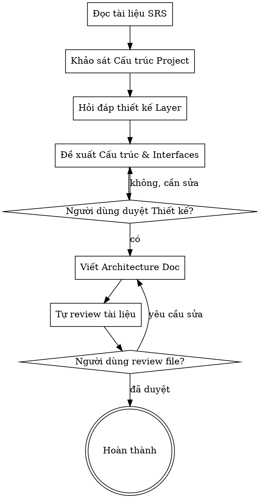

# Thiết Kế Kiến Trúc Dự Án

Giúp chuyển đổi từ Đặc tả chức năng (SRS) thành một thiết kế kiến trúc phần mềm rõ ràng, bao gồm cấu trúc thư mục, các layer cơ bản và giao thức giao tiếp giữa chúng.

<HARD-GATE>
- Phải có tài liệu SRS trước khi bắt đầu.
- Phải đọc và tuân thủ `rules/repository-rule.md` và `rules/viewmodel-mvi-rule.md`.
- KHÔNG tạo hoặc chỉnh sửa source code trong project cho đến khi tài liệu kiến trúc được User phê duyệt hoàn toàn.
- Chỉ được viết code block hoặc pseudo-code trong tài liệu kiến trúc.
- KHÔNG tự suy diễn Interface, DataSource, nguồn data, hay chức năng ngoài SRS nếu User chưa xác nhận.
- Nếu nguồn data không rõ, thiếu thông tin, không khớp giữa SRS và project hiện có, hoặc có nhiều cách hiểu, BẮT BUỘC hỏi lại User.
</HARD-GATE>

## Checklist

Bạn PHẢI hoàn thành theo thứ tự:

1. Đọc rule: `rules/repository-rule.md`, `rules/viewmodel-mvi-rule.md`.
2. Đọc SRS: xác định chức năng, User Actions, System Actions.
3. Khảo sát project: xác định `ui`, `data`, `domain`, Data Layer hiện có.
4. Hỏi làm rõ Data Layer: từng câu một, không hỏi dồn.
5. Đề xuất kiến trúc: UI Layer, Data Layer, Repository Interface.
6. Trình bày architecture tree: gồm cả Data Layer có sẵn nếu có.
7. Xin User duyệt bản nháp.
8. Viết tài liệu vào `docs/<feature name>/02-architecture.md` hoặc đường dẫn User chỉ định.
9. Tự kiểm tra tài liệu.
10. Yêu cầu User review file.

## Quy Trình



## Cách Thực Hiện

**1. Phân tích SRS**
- Bóc tách dữ liệu cần lấy.
- Bóc tách hành động làm thay đổi dữ liệu.
- Mỗi Repository Interface phải phục vụ System Actions trong SRS.
- Không thêm chức năng ngoài SRS.

**2. Khảo sát project**
- Kiểm tra package hiện có: `ui`, `data`, `domain`.
- Nếu chưa có kiến trúc rõ ràng, dùng **Repository Pattern** làm nền tảng.
- Nếu đã có Data Layer, ghi nhận cấu trúc, DataSource, Repository, model liên quan trước khi hỏi User.
- Nếu Data Layer có sẵn không khớp SRS hoặc thiếu thông tin nguồn data, hỏi lại User.

**3. Hỏi làm rõ Data Layer**
- **KHÔNG TỰ SUY DIỄN**, không hỏi dồn.
- Đặt câu hỏi làm rõ từng khía cạnh một.
- Ưu tiên câu hỏi lựa chọn trắc nghiệm.
- Không hỏi về kiến trúc UI Layer vì UI Layer tuân theo MVI trong rule.
- Nếu chưa có Data Layer, hỏi nguồn cung cấp data là gì.
- Nếu đã có Data Layer, hỏi có tái sử dụng Repository/DataSource/model hiện có không.
- Nếu đã có Data Layer, hỏi có cần mở rộng hàm hiện có không.
- Nếu đã có Data Layer, hỏi dữ liệu mới nằm ở nguồn hiện có hay nguồn mới.
- Nếu nguồn data không rõ, không khớp, hoặc có nhiều cách hiểu, hỏi lại User trước khi đề xuất kiến trúc.

**4. Đề xuất kiến trúc**
- **UI Layer:** mô tả ViewModel, UiState, Intent, SideEffect theo rule MVI.
- **Data Layer:** mô tả DataSource, Repository, model liên quan.
- **Repository Interface:** trình bày code block hoặc pseudo-code trong tài liệu. Hàm phải mapping trực tiếp với System Actions trong SRS.

Ví dụ:
  ```kotlin
  // Lấy dữ liệu cho màn hình Play Single URL
  interface PlaySingleUrlRepository {
      suspend fun importPlaylist(url: String): DataResult<Playlist>
      suspend fun getSuggestedUrls(): Flow<DataResult<List<SuggestedUrl>>>
      suspend fun addVideoStream(url: String): DataResult<Unit>
  }
  ```

**5. Trình bày bản nháp**
- Trình bày architecture tree.
- Nếu project đã có Data Layer, tree phải hiển thị cả phần có sẵn.
- Đánh dấu rõ phần giữ nguyên, phần mở rộng, phần thêm mới.
- Giải thích mục đích từng Repository Interface và từng hàm.
- Hỏi User có đồng ý với cấu trúc và Interface chưa.

## Tài Liệu Đầu Ra

- Viết thiết kế đã chốt vào `docs/<feature name>/02-architecture.md`.
- Nếu User chỉ định đường dẫn khác, ưu tiên đường dẫn của User.
- Tài liệu PHẢI bao gồm:
  - Architecture tree.
  - UI Layer: vai trò, ViewModel, UiState, Intent, SideEffect.
  - Data Layer: DataSource, Repository, model.
  - Data Layer có sẵn nếu project đã có.
  - Repository Interfaces bằng code block.
  - Ghi chú phần giữ nguyên, mở rộng, thêm mới.

## Tự Kiểm Tra

Trước khi yêu cầu User review, kiểm tra:

- Repository Interface đã phục vụ đủ System Actions trong SRS chưa?
- Có Interface, DataSource, nguồn data, hay chức năng nào tự suy diễn ngoài SRS không?
- Có nguồn data nào chưa rõ, không khớp, hoặc có nhiều cách hiểu không?
- UI Layer đã tuân thủ rule MVI chưa?
- Data Layer đã tuân thủ Repository Pattern chưa?
- Architecture tree đã hiển thị Data Layer có sẵn chưa nếu project đã có?

Nếu có điểm chưa rõ, hỏi lại User. Không tự suy diễn.

## Cổng Đánh Giá

Sau khi viết xong tài liệu, báo cáo:

> "Tôi đã viết tài liệu Thiết kế Kiến trúc tại `<đường-dẫn>`. Anh/chị vui lòng xem lại cấu trúc thư mục, thiết kế UI/Data Layer và các Interface. Hãy cho tôi biết nếu anh/chị cần điều chỉnh thêm trước khi chốt lại."

Chờ User phản hồi. Chỉ kết thúc khi User đồng ý.

## Các Nguyên Tắc Cốt Lõi

- **Dựa trên SRS:** Mọi Interface phải phục vụ mục đích đã nêu trong SRS, không tự "vẽ" thêm tính năng.
- **Repository Pattern:** UI Layer không bao giờ gọi trực tiếp Database hay Network. Phải thông qua Repository Interface. Bắt buộc tuân thủ quy tắc thiết kế tại file [repository-rule.md](./rules/repository-rule.md).
- **Thiết kế ViewModel (MVI):** Bắt buộc tuân thủ quy tắc tại file [viewmodel-mvi-rule.md](./rules/viewmodel-mvi-rule.md).
- **Ưu tiên Interface:** Phải định nghĩa rõ các hàm/phương thức giao tiếp giữa 2 layer trước khi mô tả triển khai bên trong.
- **KHÔNG TỰ SUY DIỄN**, không hỏi dồn.
- **Xác nhận từng bước:** Nhận sự đồng ý của User về bản nháp trước khi viết file tài liệu cuối cùng.
