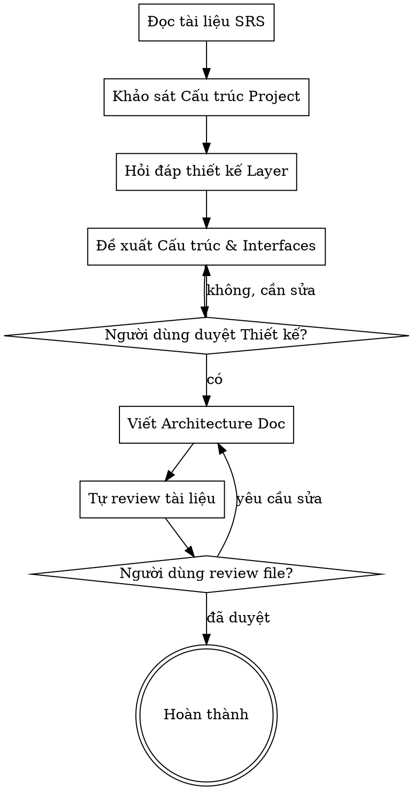

# Thiết Kế Kiến Trúc Dự Án (Architecture & Layers Design)

Giúp chuyển đổi từ Đặc tả chức năng (SRS) thành một thiết kế kiến trúc phần mềm rõ ràng, bao gồm cấu trúc thư mục, các layer cơ bản và giao thức giao tiếp giữa chúng.

<HARD-GATE>
Kỹ năng này yêu cầu người dùng cung cấp (hoặc chỉ định) tài liệu SRS trước khi bắt đầu. KHÔNG viết source code thật sự cho đến khi tài liệu kiến trúc (Architecture Doc) được người dùng phê duyệt hoàn toàn.
</HARD-GATE>

## Danh sách kiểm tra (Checklist)

Bạn PHẢI tạo một danh sách các công việc sau và hoàn thành chúng theo thứ tự:

1. **Đọc tài liệu quy tắc** — Bắt buộc đọc và tuân thủ các quy tắc trong `rules/repository-rule.md` và `rules/viewmodel-mvi-rule.md` trước khi tiến hành.
2. **Đọc tài liệu SRS** — Nắm rõ các tính năng, User Actions và System Actions.
3. **Khám phá cấu trúc dự án hiện tại** — Kiểm tra xem dự án đang sử dụng mô hình nào. Nếu chưa có kiến trúc rõ ràng, sử dụng **Repository Pattern** làm nền tảng.
4. **Đặt câu hỏi làm rõ thiết kế** — Hỏi TỪNG CÂU MỘT, tập trung vào:
   - Các đặc tính chung nhất của UI Layer (VD: State Management, ViewModel...).
   - Các đặc tính chung nhất của Data Layer (VD: Local Database, Network, Cache...).
5. **Đề xuất Cấu trúc & Interface** — Đưa ra bản nháp cấu trúc dự án (UI Layer, Data Layer). **Đặc biệt:** Định nghĩa trực tiếp (define thẳng) các Interface mà UI Layer sẽ gọi để lấy data từ Data Layer (Repository).
6. **Trình bày Thiết kế** — Gửi cho người dùng xem xét bản nháp kiến trúc và các Interface.
7. **Viết tài liệu Architecture Doc** — Lưu vào `docs/architecture/<topic>-architecture-YYYY-MM-DD.md`.
8. **Người dùng đánh giá tài liệu** — Yêu cầu người dùng duyệt file trước khi kết thúc kỹ năng.

## Sơ đồ Quy trình (Process Flow)



## Quá Trình Thực Hiện

**1. Phân tích & Khảo sát:**
- Từ file SRS, bóc tách những dữ liệu nào cần lấy (Query) và những hành động nào làm thay đổi dữ liệu (Command/Mutation).
- Dùng công cụ để xem các package hiện có trong project. Xác định xem project đã có `ui`, `data`, `domain` hay chưa. 
- Mặc định áp dụng **Repository Pattern** nếu chưa có chuẩn mực nào được đề ra.

**2. Hỏi đáp (Tương tác với người dùng):**
- **Chỉ hỏi một câu mỗi lần.** Ưu tiên câu hỏi lựa chọn trắc nghiệm.
- **Bỏ qua các câu hỏi về kiến trúc UI Layer** vì dự án đã bắt buộc dùng MVI (StateFlow, SharedFlow) theo file rule.
- Chỉ tập trung hỏi về Data Layer: nguồn cung cấp data là gì? (Ví dụ: dùng Room DB, SharedPreferences hay gọi API?).

**3. Đề xuất Kiến trúc (Định nghĩa Layer & Interface):**
- **UI Layer:** Mô tả tổng quan. Màn hình này cần ViewModel nào? Định nghĩa rõ các thành phần MVI (UiState, Intent, SideEffect) tương ứng.
- **Data Layer:** Mô tả các DataSource liên quan.
- **Interfaces (Bắt buộc):** Trình bày mã code (hoặc pseudo-code) của Repository Interface. Các hàm này phải mapping trực tiếp với các System Actions trong SRS.
  *Ví dụ:*
  ```kotlin
  // Lấy dữ liệu cho màn hình Play Single URL
  interface PlaySingleUrlRepository {
      suspend fun importPlaylist(url: String): DataResult<Playlist>
      suspend fun getSuggestedUrls(): Flow<DataResult<List<SuggestedUrl>>>
      suspend fun addVideoStream(url: String): DataResult<Unit>
  }
  ```

**4. Trình bày & Nhận phê duyệt:**
- Đưa ra cấu trúc thư mục dự kiến (cây thư mục).
- Giải thích mục đích của từng hàm trong Interface.
- Hỏi xem người dùng có đồng ý với cấu trúc và Interface này chưa.

## Sau Khi Thiết Kế

**Tài liệu (Documentation):**
- Viết tất cả các thiết kế đã chốt vào file `docs/architecture/<topic>-architecture-YYYY-MM-DD.md`.
- Tài liệu này PHẢI bao gồm:
  - Cấu trúc thư mục (Tree).
  - Định nghĩa UI Layer (Vai trò, cấu trúc MVI: UiState, Intent, SideEffect).
  - Định nghĩa Data Layer (Vai trò, DataSource, Repository).
  - **Code block chứa Repository Interfaces.**

**Cổng Đánh giá của Người dùng:**
Sau khi viết xong tài liệu, hãy báo cáo:

> "Tôi đã viết tài liệu Thiết kế Kiến trúc tại `<đường-dẫn>`. Anh/chị vui lòng xem lại cấu trúc thư mục, thiết kế UI/Data Layer và các Interface. Hãy cho tôi biết nếu anh/chị cần điều chỉnh thêm trước khi chốt lại."

Chờ người dùng phản hồi và chỉ kết thúc khi họ đồng ý.

## Các Nguyên Tắc Cốt Lõi

- **Base on SRS:** Mọi Interface phải phục vụ cho mục đích đã nêu trong SRS, không tự "vẽ" thêm tính năng.
- **Repository Pattern:** UI Layer không bao giờ gọi trực tiếp Database hay Network. Phải thông qua Repository Interface. Bắt buộc tuân thủ quy tắc thiết kế tại file [repository-rule.md](./rules/repository-rule.md).
- **Thiết kế ViewModel (MVI):** Bắt buộc tuân thủ quy tắc tại file [viewmodel-mvi-rule.md](./rules/viewmodel-mvi-rule.md).
- **Interface First:** Phải định nghĩa rõ các hàm/phương thức cần giao tiếp giữa 2 layer trước khi lo đến việc implement bên trong như thế nào.
- **Một câu hỏi mỗi lần:** Tránh hỏi dồn dập.
- **Xác nhận từng bước:** Nhận sự đồng ý của người dùng về bản nháp trước khi viết file document cuối cùng.
