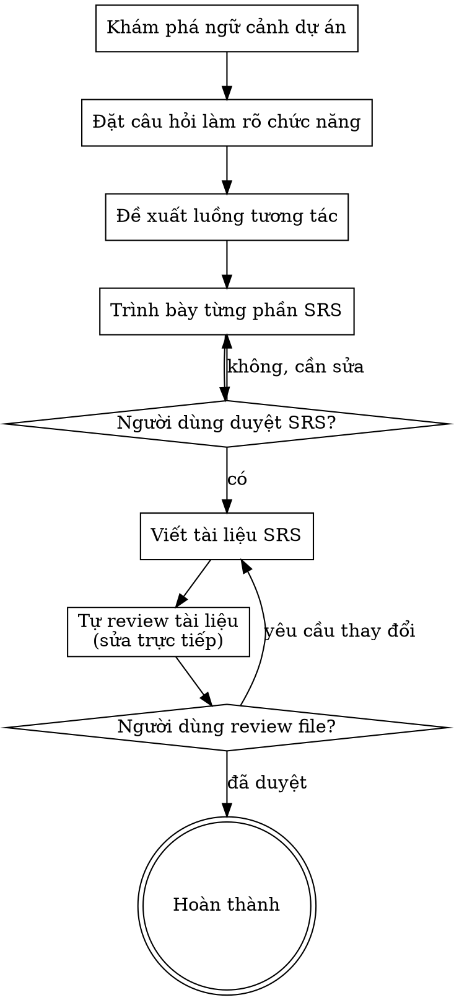

# Tạo Tài Liệu SRS

Chuyển ý tưởng thành tài liệu đặc tả chức năng qua hỏi đáp.

Tìm hiểu ngữ cảnh dự án, hỏi từng câu để làm rõ giao diện và tương tác. Khi đủ rõ, trình bày SRS và xin duyệt từ người dùng.

<HARD-GATE>
KHÔNG đề cập kỹ thuật triển khai, kiến trúc hệ thống, hay code. Chỉ mô tả chức năng, giao diện, action của user và action của system.
</HARD-GATE>

## Danh sách kiểm tra

Bạn PHẢI tạo một danh sách các công việc sau và hoàn thành chúng theo thứ tự:

1. **Khám phá ngữ cảnh dự án** — kiểm tra file, tài liệu, commit gần đây.
2. **Đặt câu hỏi làm rõ** — hỏi TỪNG CÂU MỘT, tập trung vào:
   - Màn hình có thành phần nào?
   - Người dùng có thể thao tác gì?
   - Hệ thống phản hồi gì?
3. **Đề xuất 2-3 luồng chức năng/bố cục** — nêu lựa chọn, ưu nhược điểm.
4. **Trình bày từng phần của SRS** — yêu cầu người dùng duyệt sau mỗi phần.
5. **Viết tài liệu SRS** — lưu vào `docs/<feature name>/01-srs.md`.
6. **Tự đánh giá tài liệu** — kiểm tra placeholder, mâu thuẫn, yếu tố technical/code.
7. **Người dùng đánh giá tài liệu** — yêu cầu người dùng xem lại file SRS trước khi kết thúc.

## Sơ đồ Quy trình

## Quá Trình Thực Hiện

**Hiểu yêu cầu chức năng:**

- Đánh giá trạng thái dự án hiện tại trước khi bắt đầu.
- Đặt câu hỏi làm rõ từng khía cạnh một.
- Xác định **TẤT CẢ** thành phần có trên màn hình và xác nhận lại với User trước khi mô tả SRS.
- **ĐẶC BIỆT KHÔNG ĐƯỢC TỰ SUY DIỄN** bất kỳ thành phần, hành vi, hay phản hồi nào nếu User chưa xác nhận.
- Ưu tiên câu hỏi trắc nghiệm.
- **Chỉ hỏi một câu mỗi lần** - không gộp nhiều ý vào một lần hỏi.
- Tập trung liệt kê đầy đủ:
  - **Thành phần UI:** Text, Button, Image, List, Form...
  - **Tương tác người dùng:** Click, Swipe, Scroll, Input text...
  - **Phản hồi hệ thống:** Show loading, hiện Toast, báo lỗi validation, chuyển màn hình...
- TUYỆT ĐỐI KHÔNG bàn về database, API, cấu trúc thư mục, hay công nghệ sử dụng.

**Khám phá các cách tiếp cận chức năng:**

- Đề xuất 2-3 cách bố trí giao diện hoặc luồng người dùng.
- Trình bày dạng hội thoại, nêu gợi ý và lý do.

**Trình bày SRS:**

- Khi đã rõ chức năng, trình bày từng phần SRS.
- Hỏi người dùng xem phần đó có đúng ý họ không trước khi chuyển sang phần tiếp theo.
- Nội dung gồm: danh sách màn hình, thành phần trên từng màn hình, kịch bản tương tác `User actions -> System actions`.

## Sau Khi Thiết Kế Chức Năng

**Tài liệu:**

- Viết SRS đã duyệt vào `docs/<feature name>/01-srs.md`.

**Tự kiểm tra tài liệu:**

Sau khi viết tài liệu, kiểm tra:

1. **Placeholder:** Không còn "TBD", "TODO", phần thiếu.
2. **Nhất quán:** User actions dẫn đến system actions hợp lý.
3. **Yếu tố kỹ thuật:** Không có code, database, architecture.
4. **Rõ ràng:** Không còn chức năng mơ hồ.

Sửa trực tiếp trong file rồi đi tiếp.

**Cổng Đánh giá của Người dùng:**
Sau khi viết xong, yêu cầu người dùng xem lại file:

> "Tôi đã viết tài liệu SRS tại `<đường-dẫn>`. Anh/chị vui lòng xem lại và cho biết có cần thay đổi gì trước khi chúng ta chuyển sang các bước tiếp theo không."

Đợi phản hồi. Nếu có thay đổi, sửa và quay lại vòng review. Khi người dùng đồng ý, hoàn thành kỹ năng.

## Các Nguyên Tắc Cốt Lõi

- **Một câu hỏi mỗi lần** - Không làm người dùng choáng ngợp bởi nhiều câu hỏi.
- **Ưu tiên trắc nghiệm** - Dễ trả lời hơn câu hỏi mở.
- **Không có kỹ thuật** - Tuyệt đối không bàn về code, kiến trúc, DB.
- **Xác nhận từng bước** - Trình bày từng phần và nhận sự đồng ý trước khi tiếp tục.
- **Chỉ tập trung vào chức năng** - Thành phần hiển thị, Tương tác người dùng, Phản hồi hệ thống.
