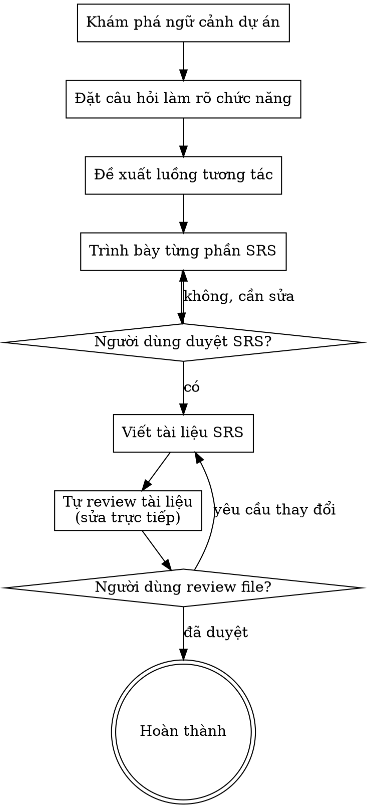

# Tạo Tài Liệu SRS (Software Requirements Specification)

Giúp chuyển đổi các ý tưởng thành một tài liệu đặc tả chức năng hoàn chỉnh thông qua quá trình hỏi đáp tương tác tự nhiên.

Bắt đầu bằng việc tìm hiểu ngữ cảnh hiện tại của dự án, sau đó đặt từng câu hỏi một để làm rõ các yêu cầu về giao diện và tương tác. Sau khi đã hiểu rõ những gì cần mô tả, hãy trình bày tài liệu đặc tả và nhận sự phê duyệt từ người dùng.

<HARD-GATE>
KHÔNG được đề cập đến bất kỳ kỹ thuật triển khai, kiến trúc hệ thống, hay viết code nào trong quá trình này. Mục tiêu duy nhất là mô tả chức năng, giao diện, action của user và action của system.
</HARD-GATE>

## Danh sách kiểm tra (Checklist)

Bạn PHẢI tạo một danh sách các công việc sau và hoàn thành chúng theo thứ tự:

1. **Khám phá ngữ cảnh dự án** — kiểm tra các file, tài liệu, commit gần đây.
2. **Đặt câu hỏi làm rõ** — hỏi TỪNG CÂU MỘT, tập trung vào:
   - Màn hình này có những thành phần (component/UI element) nào?
   - Các hành động (action) mà người dùng có thể tương tác với màn hình là gì?
   - Các hành động của hệ thống (system action) trả về là gì (ví dụ: hiển thị thông báo, toast, chuyển màn hình, v.v.)?
3. **Đề xuất 2-3 luồng chức năng/bố cục** — đưa ra các lựa chọn về cách bố trí và tương tác cùng với ưu nhược điểm.
4. **Trình bày từng phần của SRS** — trình bày từng phần của tài liệu theo mức độ phức tạp, yêu cầu người dùng phê duyệt sau mỗi phần.
5. **Viết tài liệu SRS** — lưu vào `docs/superpowers/srs/YYYY-MM-DD-<topic>-srs.md`.
6. **Tự đánh giá tài liệu (Self-review)** — kiểm tra nhanh xem có placeholder, mâu thuẫn, hay có dính dáng đến technical/code hay không (xem bên dưới).
7. **Người dùng đánh giá tài liệu** — yêu cầu người dùng xem lại file SRS trước khi kết thúc.

## Sơ đồ Quy trình (Process Flow)

## Quá Trình Thực Hiện

**Hiểu yêu cầu chức năng:**

- Đánh giá trạng thái dự án hiện tại trước khi bắt đầu.
- Đặt câu hỏi làm rõ từng khía cạnh một.
- Ưu tiên câu hỏi trắc nghiệm nếu có thể, nhưng câu hỏi mở cũng được chấp nhận.
- **Chỉ hỏi một câu mỗi lần** - không gộp nhiều ý vào một lần hỏi.
- Tập trung vào việc liệt kê đầy đủ:
  - **Thành phần UI (UI Components):** Text, Button, Image, List, Form...
  - **Tương tác người dùng (User Actions):** Click, Swipe, Scroll, Input text...
  - **Phản hồi hệ thống (System Actions):** Show loading, hiện Toast thông báo, báo lỗi validation, chuyển hướng trang (Navigate)...
- TUYỆT ĐỐI KHÔNG bàn về cơ sở dữ liệu (Database), API, cấu trúc thư mục, hay công nghệ sử dụng.

**Khám phá các cách tiếp cận chức năng:**

- Đề xuất 2-3 cách bố trí giao diện hoặc luồng người dùng khác nhau.
- Trình bày dưới dạng hội thoại, đưa ra gợi ý của bạn và lý do.

**Trình bày SRS:**

- Khi đã hiểu rõ chức năng, hãy trình bày từng phần của bản đặc tả chức năng.
- Hỏi người dùng xem phần đó có đúng ý họ không trước khi chuyển sang phần tiếp theo.
- Nội dung bao gồm: danh sách các màn hình, danh sách các thành phần trên từng màn hình, các kịch bản tương tác (User actions -> System actions).

## Sau Khi Thiết Kế Chức Năng

**Tài liệu (Documentation):**

- Viết bản đặc tả chức năng đã được duyệt vào `docs/srs/<topic>-srs-YYYY-MM-DD.md` (nếu người dùng có chỉ định đường dẫn khác thì ưu tiên đường dẫn của người dùng).

**Tự kiểm tra tài liệu (Spec Self-Review):**

Sau khi viết tài liệu, hãy xem xét lại:

1. **Quét Placeholder:** Có bất kỳ chữ "TBD", "TODO" hay phần nào chưa hoàn thiện không? Sửa chúng.
2. **Tính nhất quán:** Các hành động của người dùng có dẫn đến phản hồi hợp lý từ hệ thống không?
3. **Kiểm tra yếu tố kỹ thuật:** Có bất kỳ từ ngữ nào liên quan đến code, database, architecture không? Nếu có, phải xoá và thay bằng mô tả chức năng.
4. **Tính rõ ràng:** Các chức năng có bị mơ hồ không? Hãy làm rõ.

Sửa trực tiếp trong file. Không cần lặp lại quá trình review — chỉ cần sửa và đi tiếp.

**Cổng Đánh giá của Người dùng:**
Sau khi viết xong tài liệu, yêu cầu người dùng xem lại file trước khi tiếp tục:

> "Tôi đã viết tài liệu SRS tại `<đường-dẫn>`. Anh/chị vui lòng xem lại và cho biết có cần thay đổi gì trước khi chúng ta chuyển sang các bước tiếp theo không."

Đợi phản hồi của người dùng. Nếu họ yêu cầu thay đổi, hãy thực hiện và quay lại vòng review. Khi họ đồng ý, bạn đã hoàn thành kỹ năng.

## Các Nguyên Tắc Cốt Lõi

- **Một câu hỏi mỗi lần** - Không làm người dùng choáng ngợp bởi nhiều câu hỏi.
- **Ưu tiên trắc nghiệm** - Dễ trả lời hơn câu hỏi mở.
- **Không có kỹ thuật (No Tech)** - Tuyệt đối không bàn về code, kiến trúc, DB.
- **Xác nhận từng bước** - Trình bày từng phần và nhận sự đồng ý trước khi tiếp tục.
- **Chỉ tập trung vào chức năng** - Thành phần hiển thị, Tương tác người dùng, Phản hồi hệ thống.
