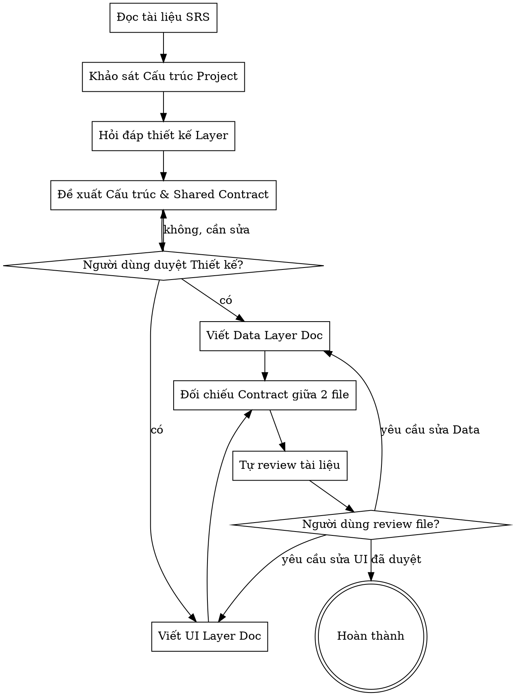

# Thiết Kế Kiến Trúc Dự Án

Giúp chuyển đổi từ Đặc tả chức năng (SRS) thành thiết kế kiến trúc phần mềm rõ ràng, tách thành 2 tài liệu độc lập: UI Layer và Data Layer. Hai tài liệu phải thống nhất qua Shared Repository Contract.

<HARD-GATE>
- Phải có tài liệu SRS trước khi bắt đầu.
- Phải đọc và tuân thủ `rules/repository-rule.md` và `rules/viewmodel-mvi-rule.md`.
- KHÔNG tạo hoặc chỉnh sửa source code trong project cho đến khi tài liệu kiến trúc được User phê duyệt hoàn toàn.
- Chỉ được viết code block hoặc pseudo-code trong tài liệu kiến trúc.
- KHÔNG tự suy diễn Interface, DataSource, nguồn data, hay chức năng ngoài SRS nếu User chưa xác nhận.
- Nếu nguồn data không rõ, thiếu thông tin, không khớp giữa SRS và project hiện có, hoặc có nhiều cách hiểu, BẮT BUỘC hỏi lại User.
</HARD-GATE>

## Checklist

Bạn PHẢI hoàn thành theo thứ tự:

1. Đọc rule: `rules/repository-rule.md`, `rules/viewmodel-mvi-rule.md`.
2. Đọc SRS: xác định chức năng, User Actions, System Actions.
3. Khảo sát project: xác định `ui`, `data`, `domain`, Data Layer hiện có.
4. Hỏi làm rõ Data Layer nếu còn điểm chưa rõ: từng câu một, không hỏi dồn.
5. Đề xuất kiến trúc: UI Layer, Data Layer, Shared Repository Contract.
6. Trình bày architecture tree: gồm cả Data Layer có sẵn nếu có.
7. Xin User duyệt bản nháp.
8. Viết tài liệu thành 2 file riêng: `docs/<feature name>/02-ui-layer.md` và `docs/<feature name>/03-data-layer.md` hoặc đường dẫn User chỉ định.
9. Tự kiểm tra tài liệu.
10. Yêu cầu User review file.

## Quy Trình



## Cách Thực Hiện

**1. Phân tích SRS**
- Bóc tách dữ liệu cần lấy.
- Bóc tách hành động làm thay đổi dữ liệu.
- Mỗi Repository Interface phải phục vụ System Actions trong SRS.
- Không thêm chức năng ngoài SRS.

**2. Khảo sát project**
- Kiểm tra package hiện có: `ui`, `data`, `domain`.
- Nếu chưa có kiến trúc rõ ràng, dùng **Repository Pattern** làm nền tảng.
- Nếu đã có Data Layer, ghi nhận cấu trúc, DataSource, Repository, model liên quan trước khi hỏi User.
- Nếu Data Layer có sẵn không khớp SRS hoặc thiếu thông tin nguồn data, hỏi lại User.

**3. Hỏi làm rõ Data Layer**
- **KHÔNG TỰ SUY DIỄN**, không hỏi dồn.
- Đặt câu hỏi làm rõ từng khía cạnh một.
- Ưu tiên câu hỏi lựa chọn trắc nghiệm.
- Không hỏi về kiến trúc UI Layer vì UI Layer tuân theo MVI trong rule.
- Chỉ hỏi khi SRS, project hiện có, hoặc nguồn data còn thiếu rõ ràng.
- Nếu chưa có Data Layer, hỏi nguồn cung cấp data là gì.
- Nếu đã có Data Layer, hỏi có tái sử dụng Repository/DataSource/model hiện có không.
- Nếu đã có Data Layer, hỏi có cần mở rộng hàm hiện có không.
- Nếu đã có Data Layer, hỏi dữ liệu mới nằm ở nguồn hiện có hay nguồn mới.
- Nếu nguồn data không rõ, không khớp, hoặc có nhiều cách hiểu, hỏi lại User trước khi đề xuất kiến trúc.

**4. Đề xuất kiến trúc**
- **UI Layer:** mô tả ViewModel, UiState, Intent, SideEffect theo rule MVI.
- **Data Layer:** mô tả DataSource, Repository, model liên quan.
- **Shared Repository Contract:** trình bày Repository Interface bằng code block hoặc pseudo-code. Hàm phải mapping trực tiếp với System Actions trong SRS.
- Shared Repository Contract là nguồn sự thật chung cho cả `02-ui-layer.md` và `03-data-layer.md`.
- Phải chốt Shared Repository Contract với User trước khi viết các file tài liệu cuối cùng.

Ví dụ:
  ```kotlin
  // Lấy dữ liệu cho màn hình Play Single URL
  interface PlaySingleUrlRepository {
      suspend fun importPlaylist(url: String): DataResult<Playlist>
      suspend fun getSuggestedUrls(): Flow<DataResult<List<SuggestedUrl>>>
      suspend fun addVideoStream(url: String): DataResult<Unit>
  }
  ```

**5. Trình bày bản nháp**
- Trình bày architecture tree.
- Nếu project đã có Data Layer, tree phải hiển thị cả phần có sẵn.
- Đánh dấu rõ phần giữ nguyên, phần mở rộng, phần thêm mới.
- Giải thích mục đích từng Repository Interface và từng hàm.
- Hỏi User có đồng ý với cấu trúc và Interface chưa.

## Tài Liệu Đầu Ra

- Viết thiết kế đã chốt thành 2 file riêng:
  - `docs/<feature name>/02-ui-layer.md`.
  - `docs/<feature name>/03-data-layer.md`.
- Nếu User chỉ định đường dẫn khác, ưu tiên đường dẫn của User nhưng vẫn phải tách UI Layer và Data Layer thành 2 file riêng.
- Không ghi UI Layer và Data Layer vào cùng một file.
- Hai file phải có cùng tên feature và cùng phạm vi chức năng theo SRS.
- Nếu đã có tài liệu cũ `docs/<feature name>/02-architecture.md`, chỉ đọc để tham khảo khi cần. Không ghi tiếp thiết kế mới vào file đó nếu User không yêu cầu.

### Chế Độ Đầu Ra

- Nếu User yêu cầu UI Layer only, chỉ tạo hoặc chỉnh `02-ui-layer.md`.
- Nếu User yêu cầu Data Layer only, chỉ tạo hoặc chỉnh `03-data-layer.md`.
- Nếu User yêu cầu full architecture, tạo hoặc chỉnh cả `02-ui-layer.md` và `03-data-layer.md`.

### Shared Repository Contract

- Shared Repository Contract là nguồn sự thật chung giữa UI Layer và Data Layer.
- Shared Repository Contract phải bao gồm Repository Interface name, function signature, input model, output model, và result/error wrapper nếu có.
- `03-data-layer.md` chứa Shared Repository Contract đầy đủ.
- `02-ui-layer.md` chỉ lặp lại Repository Interface/function mà UI được phép gọi, không mô tả triển khai bên trong.
- Nếu cần đổi Repository Interface name hoặc function signature sau khi đã chốt, phải hỏi User trước khi sửa tài liệu.

### File UI Layer: `02-ui-layer.md`

Tài liệu UI Layer PHẢI bao gồm:

- `# <Feature Name> UI Layer Architecture`.
- `## Scope`.
- UI architecture tree.
- Vai trò màn hình/component.
- ViewModel theo MVI.
- UiState.
- Intent/User Action.
- SideEffect/System feedback.
- Repository Interface mà UI Layer được phép gọi.
- Mapping từ User Actions/System Actions trong SRS sang Intent, UiState update, SideEffect, Repository call. Chỉ nêu function call, input, output ở cấp UI; không mô tả DataSource.
- Ghi chú phần giữ nguyên, mở rộng, thêm mới.
- Không mô tả chi tiết DataSource, API, Database, DTO, Entity, mapper, hoặc triển khai Repository.

### File Data Layer: `03-data-layer.md`

Tài liệu Data Layer PHẢI bao gồm:

- `# <Feature Name> Data Layer Architecture`.
- `## Scope`.
- Data architecture tree.
- Data Layer có sẵn nếu project đã có.
- DataSource.
- Repository implementation dự kiến.
- Model liên quan.
- Shared Repository Contract bằng code block.
- Mapping từ System Actions trong SRS sang Repository function, DataSource, model.
- Ghi chú phần giữ nguyên, mở rộng, thêm mới.
- Không mô tả chi tiết ViewModel, UiState, Intent, SideEffect ngoài tên Repository Interface mà UI gọi.

## Tự Kiểm Tra

Trước khi yêu cầu User review, kiểm tra:

- Repository Interface đã phục vụ đủ System Actions trong SRS chưa?
- Có Interface, DataSource, nguồn data, hay chức năng nào tự suy diễn ngoài SRS không?
- Có nguồn data nào chưa rõ, không khớp, hoặc có nhiều cách hiểu không?
- `02-ui-layer.md` đã tuân thủ rule MVI chưa?
- `03-data-layer.md` đã tuân thủ Repository Pattern chưa?
- Hai file có thống nhất Repository Interface name, function count, function parameters, return type, input model, output model, và result/error wrapper không?
- UI Layer có tránh mô tả chi tiết DataSource/API/Database không?
- Data Layer có tránh mô tả chi tiết ViewModel/UiState/Intent/SideEffect không?
- UI architecture tree đã đủ màn hình/component trong SRS chưa?
- Architecture tree đã hiển thị Data Layer có sẵn chưa nếu project đã có?

Nếu có điểm chưa rõ, hỏi lại User. Không tự suy diễn.

## Cổng Đánh Giá

Sau khi viết xong tài liệu, báo cáo:

> "Tôi đã viết tài liệu Thiết kế Kiến trúc tại `<đường-dẫn-ui>` và `<đường-dẫn-data>`. Anh/chị vui lòng xem lại cấu trúc UI Layer, Data Layer và Shared Repository Contract giữa hai file. Hãy cho tôi biết nếu anh/chị cần điều chỉnh thêm trước khi chốt lại."

Chờ User phản hồi. Chỉ kết thúc khi User đồng ý.

## Các Nguyên Tắc Cốt Lõi

- **Dựa trên SRS:** Mọi Interface phải phục vụ mục đích đã nêu trong SRS, không tự "vẽ" thêm tính năng.
- **Repository Pattern:** UI Layer không bao giờ gọi trực tiếp Database hay Network. Phải thông qua Repository Interface. Bắt buộc tuân thủ quy tắc thiết kế tại file [repository-rule.md](./rules/repository-rule.md).
- **Thiết kế ViewModel (MVI):** Bắt buộc tuân thủ quy tắc tại file [viewmodel-mvi-rule.md](./rules/viewmodel-mvi-rule.md).
- **Ưu tiên Shared Contract:** Phải định nghĩa rõ Repository Interface và các hàm/phương thức giao tiếp giữa 2 layer trước khi mô tả triển khai bên trong.
- **KHÔNG TỰ SUY DIỄN**, không hỏi dồn.
- **Xác nhận từng bước:** Nhận sự đồng ý của User về bản nháp và Shared Repository Contract trước khi viết các file tài liệu cuối cùng.
